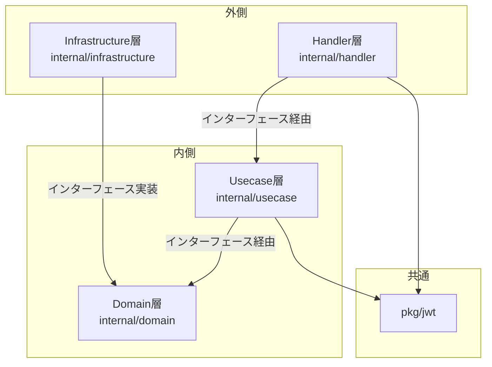
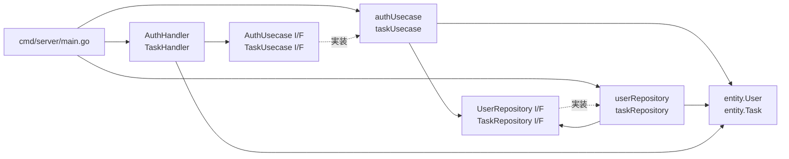
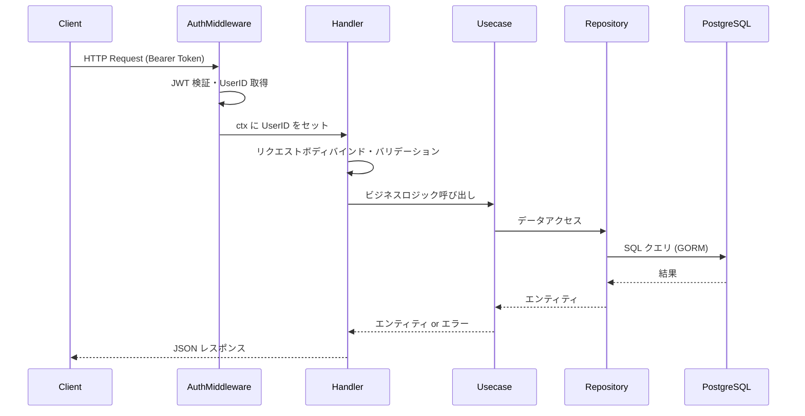

# アーキテクチャ図

## レイヤー構成

クリーンアーキテクチャ（Clean Architecture）の考え方に基づき、4つの層に分離されています。
各層は内側の層にのみ依存し、外側の層を知りません。



## 依存関係の詳細



## 各層の責務

| 層 | パッケージ | 責務 |
|---|---|---|
| **Handler 層** | `internal/handler` | HTTP リクエストのパース、バリデーション、レスポンス生成 |
| **Middleware 層** | `internal/handler/middleware` | JWT 検証、コンテキストへのユーザー ID 設定 |
| **Usecase 層** | `internal/usecase` | ビジネスロジック（重複チェック、パスワードハッシュ化、所有権確認）|
| **Domain 層** | `internal/domain` | エンティティ定義、リポジトリインターフェース、ドメインエラー |
| **Infrastructure 層** | `internal/infrastructure` | GORM を使った DB 操作の実装 |
| **pkg 層** | `pkg/jwt` | JWT 生成・検証ユーティリティ |

## リクエスト処理フロー



## DI（依存性注入）

`cmd/server/main.go` でコンストラクタ注入により全依存関係を組み立てています。

```
DB → UserRepository → AuthUsecase → AuthHandler → Router
DB → TaskRepository → TaskUsecase → TaskHandler → Router
```
