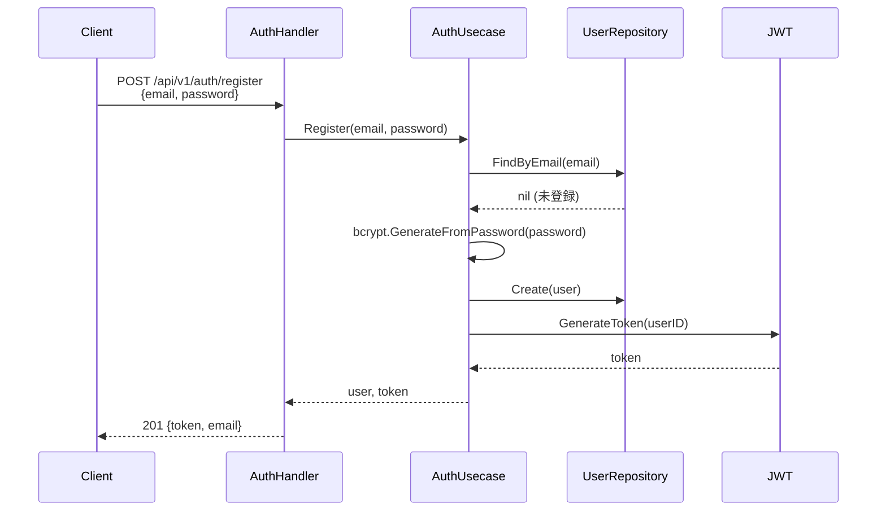
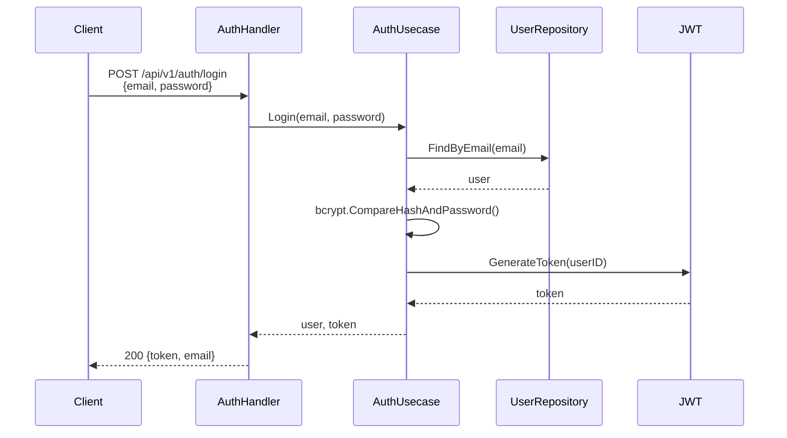
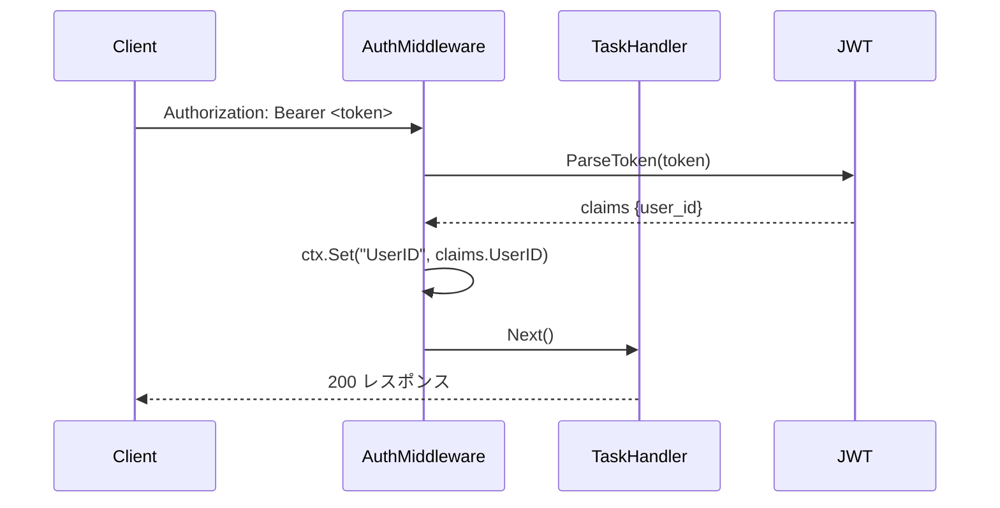

# 認証・認可フロー

## 認証方式

JWT (JSON Web Token) による Bearer Token 認証を採用しています。

- 署名アルゴリズム: **HS256**（HMAC-SHA256）
- トークン有効期限: デフォルト **72時間**（`JWT_EXPIRATION_HOURS` で変更可能）
- クレーム: `user_id`（ユーザーID）、`exp`（有効期限）、`iat`（発行日時）

## 保護されたリソース

| エンドポイント | 認証要否 |
|---|---|
| `POST /api/v1/auth/register` | 不要 |
| `POST /api/v1/auth/login` | 不要 |
| `POST /api/v1/tasks` | **必要** |
| `GET /api/v1/tasks` | **必要** |
| `GET /api/v1/tasks/:id` | **必要** |
| `PUT /api/v1/tasks/:id` | **必要** |
| `DELETE /api/v1/tasks/:id` | **必要** |

## 認証フロー

### ユーザー登録



### ログイン



### 認証済みリクエスト



## Authorization ヘッダーの形式

```
Authorization: Bearer <JWT トークン>
```

`Bearer` プレフィックスが必須です。形式が異なる場合は 401 エラーが返されます。
