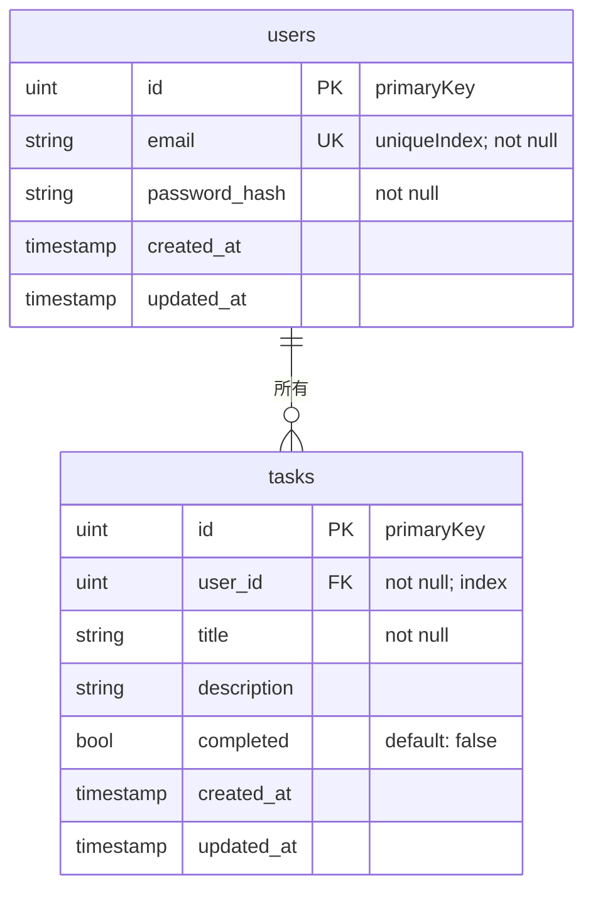

# DB スキーマ

## 概要

GORM の `AutoMigrate` によりアプリケーション起動時に自動でテーブルが作成・更新されます。
対象エンティティ: `entity.User`、`entity.Task`

## ER 図

## テーブル定義

### users テーブル

| カラム名 | 型 | 制約 | 説明 |
|---|---|---|---|
| `id` | uint | PK | ユーザー ID（自動採番） |
| `email` | string | UNIQUE, NOT NULL | メールアドレス |
| `password_hash` | string | NOT NULL | bcrypt ハッシュ化済みパスワード |
| `created_at` | timestamp | | 作成日時（GORM 自動設定） |
| `updated_at` | timestamp | | 更新日時（GORM 自動設定） |

### tasks テーブル

| カラム名 | 型 | 制約 | 説明 |
|---|---|---|---|
| `id` | uint | PK | タスク ID（自動採番） |
| `user_id` | uint | FK, NOT NULL, INDEX | 所有ユーザー ID |
| `title` | string | NOT NULL | タスクタイトル |
| `description` | string | | タスク説明（任意） |
| `completed` | bool | DEFAULT false | 完了フラグ |
| `created_at` | timestamp | | 作成日時（GORM 自動設定） |
| `updated_at` | timestamp | | 更新日時（GORM 自動設定） |

## 設計上の注意事項

- `password_hash` は JSON レスポンスに含まれません（`json:"-"` タグ指定）
- タスクは `user_id` によりユーザーに紐付けられ、他ユーザーのタスクには Usecase 層でアクセスを制限しています
- `user_id` カラムには GORM インデックスが設定されており、ユーザーのタスク一覧取得が効率化されています
- 外部キー制約は GORM AutoMigrate では自動設定されません（DB レベルの CASCADE は手動設定が必要）
